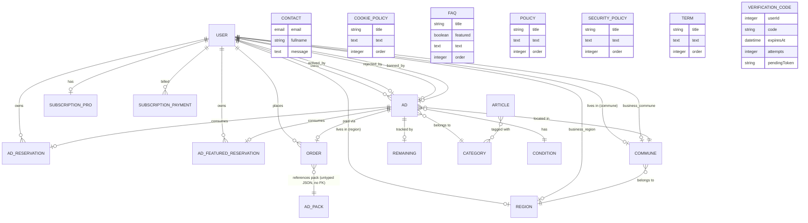

# Backend Schema Document (BSD)

This document is the as-built source of truth for the Waldo backend data model. It is derived directly from the live `schema.json` files under `apps/strapi/src/api/*/content-types/*/schema.json` (20 content-types) and `apps/strapi/src/extensions/users-permissions/content-types/user/schema.json` (the 21st — `User`), verified 2026-07-02. It supersedes `docs/data-model.md` as the schema reference; `docs/data-model.md` predates Phase 4 and lists only 16 entities (see corrections noted inline below).

All business logic and data live in Strapi v5. `apps/website` (public site + `/dashboard/**` admin routes) is a stateless HTTP client.

---

## Table of Contents

- [Entity-Relationship Diagram](#entity-relationship-diagram)
- [Entity Reference](#entity-reference)
  - [Ad](#ad)
  - [AdFeaturedReservation](#adfeaturedreservation)
  - [AdPack](#adpack)
  - [AdReservation](#adreservation)
  - [Article](#article)
  - [Category](#category)
  - [Commune](#commune)
  - [Condition](#condition)
  - [Contact](#contact)
  - [CookiePolicy](#cookiepolicy)
  - [Faq](#faq)
  - [Order](#order)
  - [Policy](#policy)
  - [Region](#region)
  - [Remaining](#remaining)
  - [SecurityPolicy](#securitypolicy)
  - [SubscriptionPayment](#subscriptionpayment)
  - [SubscriptionPRO](#subscriptionpro)
  - [Term](#term)
  - [VerificationCode](#verificationcode)
  - [User](#user)
- [API Endpoint Reference](#api-endpoint-reference)
- [Preguntas abiertas](#preguntas-abiertas)

---

## Entity-Relationship Diagram

All 21 entities are represented as diagram nodes. 14 participate in live relations, derived from each entity's `attributes` where `type: "relation"` (cardinality read from the schema's `relation` field — `oneToOne`, `oneToMany`, `manyToOne`, `manyToMany` — mapped to Mermaid `erDiagram` relation notation). The remaining 7 (`Contact`, `CookiePolicy`, `Faq`, `Policy`, `SecurityPolicy`, `Term`, `VerificationCode`) have zero relation attributes in their schema and are declared as standalone entity blocks with their key fields, per Mermaid's entity-without-relation syntax.

**Notes on the diagram:**
- `AdPack` (`Pack`) has no formal relation attribute pointing to it from `Order` or `Ad` in any schema.json — the pack reference lives inside `Order.items` (untyped `json` field), not as a Strapi relation. Shown above as a soft/logical link, not an enforced FK.
- `Category`, `Condition` have no inbound relations beyond what is shown. `Contact`, `CookiePolicy`, `Faq`, `Policy`, `SecurityPolicy`, `Term`, `VerificationCode` have zero relation attributes at all — declared above as standalone entity blocks (no connecting edges) rather than participants in a relation line.
- `AdReservation`/`AdFeaturedReservation` model both directions of the ad-slot lifecycle: a `manyToOne` to `User` (a user can hold many reservation slots) and a `oneToOne` to `Ad` (a slot is consumed by at most one ad at a time; freed back to `ad: null` on reject/ban per the cron in `apps/strapi/src/cron/ad-free-reservation-restore.cron.ts`).

---

## Entity Reference

Each subsection lists the entity's own attributes as declared in its `schema.json`. Relation fields include their target and cardinality. Fields common to Strapi (`id`, `documentId`, `createdAt`, `updatedAt`, `publishedAt`) are omitted since `draftAndPublish: false` on every content-type in this project — no entity has a draft/publish workflow at the Strapi document level (the `Ad.draft` boolean is an application-level field, unrelated to Strapi's draftAndPublish feature).

### Ad

Source: `apps/strapi/src/api/ad/content-types/ad/schema.json`

| Field | Type | Notes/Relation |
| --- | --- | --- |
| `name` | string, required | Ad title |
| `slug` | uid (target: `name`), required | |
| `description` | text | |
| `address` | string | |
| `address_number` | string | |
| `phone` | string | |
| `email` | email | |
| `year` | biginteger | |
| `manufacturer` | string | |
| `model` | string | |
| `serial_number` | string | |
| `weight` / `width` / `height` / `depth` | biginteger | |
| `commune` | relation, `oneToOne` | → Commune |
| `condition` | relation, `oneToOne` | → Condition |
| `user` | relation, `manyToOne`, inverse `ads` | → User (owner) |
| `gallery` | media, multiple, images only | |
| `category` | relation, `oneToOne` | → Category |
| `price` | biginteger, required | |
| `rejected` / `banned` | boolean, required, default `false` | Moderation flags |
| `rejected_at` / `banned_at` | datetime | |
| `reason_for_rejection` / `reason_for_ban` / `reason_for_deactivation` | text | |
| `currency` | enumeration `["CLP", "USD"]`, required | |
| `duration_days` | integer, required, default `0` | |
| `remaining_days` | integer, required, default `0` | Decremented daily by `ad-expiry.cron.ts` |
| `details` | json | |
| `ad_reservation` | relation, `oneToOne`, mappedBy `ad` | ← AdReservation |
| `ad_featured_reservation` | relation, `oneToOne`, mappedBy `ad` | ← AdFeaturedReservation |
| `order` | relation, `oneToOne`, mappedBy `ad` | ← Order |
| `is_paid` | boolean, default `false` | |
| `active` | boolean, required, default `false` | |
| `draft` | boolean, required, default `true` | Application-level draft flag (added v1.21) — not Strapi draftAndPublish |
| `actived_at` | datetime | |
| `actived_by` / `rejected_by` / `banned_by` | relation, `oneToOne` | → User (which manager acted) |
| `sort_priority` | integer, required, default `2` | |

`Ad.status` is a **virtual, computed field** — not stored in the database. Computed by `computeAdStatus()` in `apps/strapi/src/api/ad/services/ad.ts`. See `docs/ad-statuses.md` for the full computation logic (correction over `docs/data-model.md`, which lists `title` as a field name — the real field is `name`).

### AdFeaturedReservation

Source: `apps/strapi/src/api/ad-featured-reservation/content-types/ad-featured-reservation/schema.json`

| Field | Type | Notes/Relation |
| --- | --- | --- |
| `price` | biginteger, required | `"0"` string comparison marks a free slot in service code |
| `total_days` | integer | Optional — featured reservations have no expiry concept |
| `user` | relation, `manyToOne`, inverse `ad_featured_reservations` | → User |
| `description` | text | |
| `ad` | relation, `oneToOne`, inverse `ad_featured_reservation` | → Ad (nullable — freed on reject/ban) |

Correction over `docs/data-model.md`: that doc lists `used`/`gifted` boolean fields on this entity — no such fields exist in the live schema. Slot occupancy is derived from whether `ad` is null, not a boolean flag.

### AdPack

Source: `apps/strapi/src/api/ad-pack/content-types/ad-pack/schema.json`

| Field | Type | Notes/Relation |
| --- | --- | --- |
| `name` | string | |
| `total_days` | biginteger | |
| `total_ads` | biginteger | |
| `total_features` | biginteger | |
| `price` | biginteger | |

No relation attributes. Referenced from checkout flow logic and `Order.items` (untyped JSON), not via a Strapi FK. Correction over `docs/data-model.md`: that doc calls this entity "Pack" with fields `days`/`pack_type`/`ads_quantity`/`featured_quantity` — the real field names are `total_days`/`total_ads`/`total_features` and there is no `pack_type` field on this content-type.

### AdReservation

Source: `apps/strapi/src/api/ad-reservation/content-types/ad-reservation/schema.json`

| Field | Type | Notes/Relation |
| --- | --- | --- |
| `price` | biginteger, required | `"0"` marks a free slot |
| `total_days` | integer | |
| `user` | relation, `manyToOne`, inverse `ad_reservations` | → User |
| `description` | text | |
| `ad` | relation, `oneToOne`, inverse `ad_reservation` | → Ad (nullable — freed on reject/ban) |

Same correction as AdFeaturedReservation: no `used`/`gifted` booleans in the live schema.

### Article

Source: `apps/strapi/src/api/article/content-types/article/schema.json`

| Field | Type | Notes/Relation |
| --- | --- | --- |
| `title` | string, required | |
| `slug` | uid (target: `title`) | |
| `header` | string | |
| `body` | richtext | Rendered as Markdown on the website via `marked` |
| `cover` | media, multiple, images only | |
| `gallery` | media, multiple, images only | |
| `categories` | relation, `manyToMany` | → Category |
| `seo_title` / `seo_description` | string | |
| `source_url` | string | Added v1.31 — optional external source attribution link |
| `is_published` | boolean, default `false` | |

Not present in `docs/data-model.md`'s table under the correct field names (it lists `content`/`published_at`, which do not exist — real fields are `body`/`is_published`).

### Category

Source: `apps/strapi/src/api/category/content-types/category/schema.json`

| Field | Type | Notes/Relation |
| --- | --- | --- |
| `name` | string, required | |
| `slug` | uid (target: `name`) | |
| `color` | string | |
| `icon` | media, single, images only, required | |

### Commune

Source: `apps/strapi/src/api/commune/content-types/commune/schema.json`

| Field | Type | Notes/Relation |
| --- | --- | --- |
| `name` | string, required, unique | |
| `slug` | uid (target: `name`), required | |
| `region` | relation, `manyToOne`, inverse `communes` | → Region |

### Condition

Source: `apps/strapi/src/api/condition/content-types/condition/schema.json`

| Field | Type | Notes/Relation |
| --- | --- | --- |
| `name` | string, required | |
| `slug` | uid (target: `name`) | |

No relations. Correction over `docs/data-model.md`, which lists `title`/`content` — real fields are `name`/`slug`.

### Contact

Source: `apps/strapi/src/api/contact/content-types/contact/schema.json`

| Field | Type | Notes/Relation |
| --- | --- | --- |
| `email` | email | |
| `fullname` | string | |
| `message` | text | |
| `ip` | string | |
| `phone` | string | |
| `company` | string | |

No relations. Not present in `docs/data-model.md` at all (Pitfall confirmed — see intro).

### CookiePolicy

Source: `apps/strapi/src/api/cookie-policy/content-types/cookie-policy/schema.json`

| Field | Type | Notes/Relation |
| --- | --- | --- |
| `title` | string, required | |
| `text` | text | |
| `order` | integer | Drag-and-drop ordering in dashboard (Phase 4) |

No relations. Added Phase 4 (2026-07-01) — absent from `docs/data-model.md`.

### Faq

Source: `apps/strapi/src/api/faq/content-types/faq/schema.json`

| Field | Type | Notes/Relation |
| --- | --- | --- |
| `title` | string | |
| `featured` | boolean | |
| `text` | text | |
| `order` | integer | |

No relations. Correction over `docs/data-model.md`, which names the fields `question`/`answer` — real fields are `title`/`text`.

### Order

Source: `apps/strapi/src/api/order/content-types/order/schema.json`

| Field | Type | Notes/Relation |
| --- | --- | --- |
| `amount` | biginteger | |
| `buy_order` | string, unique | Webpay-specific gateway reference — audit only, never a primary identifier (see CLAUDE.md Payment Rules) |
| `user` | relation, `manyToOne`, inverse `orders` | → User |
| `is_invoice` | boolean, default `false` | |
| `payment_method` | enumeration `["webpay", "transbank"]` | |
| `payment_response` | json | Full gateway response payload — source for the Webpay receipt fields on `/pagar/gracias` |
| `document_details` | json | |
| `ad` | relation, `oneToOne`, inverse `order` | → Ad (nullable — pack-only orders have no ad) |
| `document_response` | json | |
| `items` | json | Cart/pack line items — this is where pack selection lives, not a Strapi relation |

**Order identity is always `order.documentId`, never a gateway reference** (`buy_order`, `token_ws`, `TBK_*`) — see CLAUDE.md Payment Rules. Correction over `docs/data-model.md`, which lists `status`/`token_ws`/`card_number`/`transaction_date` as fields — none of these exist on the live schema; that data lives inside `payment_response`/`document_response` JSON blobs instead.

### Policy

Source: `apps/strapi/src/api/policy/content-types/policy/schema.json`

| Field | Type | Notes/Relation |
| --- | --- | --- |
| `title` | string, required | |
| `text` | text | |
| `order` | integer | |

No relations. Correction over `docs/data-model.md`: field is `text`, not `content`.

### Region

Source: `apps/strapi/src/api/region/content-types/region/schema.json`

| Field | Type | Notes/Relation |
| --- | --- | --- |
| `name` | string, required, unique | |
| `slug` | uid (target: `name`), required | |
| `communes` | relation, `oneToMany`, mappedBy `region` | ← Commune |

### Remaining

Source: `apps/strapi/src/api/remaining/content-types/remaining/schema.json`

| Field | Type | Notes/Relation |
| --- | --- | --- |
| `ad` | relation, `oneToOne` | → Ad |

No other fields. Used by the ad-expiry cron for decrement-once-per-day tracking. Entirely absent from `docs/data-model.md`.

### SecurityPolicy

Source: `apps/strapi/src/api/security-policy/content-types/security-policy/schema.json`

| Field | Type | Notes/Relation |
| --- | --- | --- |
| `title` | string, required | |
| `text` | text | |
| `order` | integer | |

No relations. Added Phase 4 (2026-07-01) — absent from `docs/data-model.md`.

### SubscriptionPayment

Source: `apps/strapi/src/api/subscription-payment/content-types/subscription-payment/schema.json`

| Field | Type | Notes/Relation |
| --- | --- | --- |
| `user` | relation, `manyToOne` | → User |
| `amount` | integer, required | |
| `status` | enumeration `["approved", "failed", "deactivated"]`, required, default `failed` | |
| `parent_buy_order` / `child_buy_order` | string | Oneclick Mall parent/child transaction references |
| `authorization_code` | string | |
| `response_code` | integer | |
| `payment_response` | json | |
| `period_start` / `period_end` | date, required | |
| `charged_at` | datetime | |
| `charge_attempts` | integer, default `1` | |
| `next_charge_attempt` | date | Retry scheduling for `subscription-charge.cron.ts` |

Correction over `docs/data-model.md`: no direct relation attribute to `SubscriptionPro` on this entity — the linkage is by `user`, not a `SubscriptionPro` FK.

### SubscriptionPRO

Source: `apps/strapi/src/api/subscription-pro/content-types/subscription-pro/schema.json`

| Field | Type | Notes/Relation |
| --- | --- | --- |
| `user` | relation, `oneToOne`, inverse `subscription_pro` | → User |
| `tbk_user` | string, private | Oneclick Mall inscription identity token |
| `card_type` | string | |
| `card_last4` | string | |
| `inscription_token` | string, private | |
| `pending_invoice` | boolean, default `false` | |

`User.pro_status` (`"active" \| "inactive" \| "cancelled"`, on the User entity, not here) is the single source of truth for PRO membership status — this entity holds Oneclick card/inscription data only, not status. Correction over `docs/data-model.md`: that doc lists `status`/`card_number`/`period_end` fields on "SubscriptionPro" — none of these exist here; `status` lives on `User.pro_status`, `period_end` lives on `SubscriptionPayment`, and the card field is `card_last4` not `card_number`.

### Term

Source: `apps/strapi/src/api/term/content-types/term/schema.json`

| Field | Type | Notes/Relation |
| --- | --- | --- |
| `title` | string, required | |
| `text` | text | |
| `order` | integer | |

No relations. Correction over `docs/data-model.md`: field is `text`, not `content`.

### VerificationCode

Source: `apps/strapi/src/api/verification-code/content-types/verification-code/schema.json`

| Field | Type | Notes/Relation |
| --- | --- | --- |
| `userId` | integer, required | Plain integer, not a Strapi relation attribute |
| `code` | string, required | 6-digit 2-step login code |
| `expiresAt` | datetime, required | 15-minute expiry window |
| `attempts` | integer, default `0` | Max 3 attempts enforced in `POST /api/auth/verify-code` |
| `pendingToken` | string, unique, required | Handoff token between step 1 (`POST /auth/local`) and step 2 |

No relations. Added v1.36 (2-step login verification). Entirely absent from `docs/data-model.md`.

### User

Source: `apps/strapi/src/extensions/users-permissions/content-types/user/schema.json` (users-permissions plugin extension — **not** under `apps/strapi/src/api/`; a glob of `api/*/content-types/*/schema.json` alone silently misses this entity).

| Field | Type | Notes/Relation |
| --- | --- | --- |
| `username` | string, unique, required, min 3 | |
| `email` | email, unique (plugin-enforced), required, min 6 | |
| `provider` | string | `"local"` \| `"google"` etc. |
| `google_sub` | string, private, unique | Google OAuth subject identifier |
| `password` | password, private | |
| `resetPasswordToken` / `confirmationToken` | string, private | |
| `confirmed` / `blocked` | boolean, default `false` | |
| `role` | relation, `manyToOne`, inverse `users` | → `plugin::users-permissions.role` |
| `last_username_change` | date, private | 90-day cooldown enforcement |
| `firstname` / `lastname` | string, required | |
| `rut` | string, required | Chilean tax ID |
| `region` / `commune` | relation, `oneToOne` | → Region / Commune (personal address) |
| `phone` | string | |
| `is_company` | boolean, default `false` | |
| `address` / `address_number` / `postal_code` | string / integer / string | |
| `birthdate` | date | |
| `avatar` / `cover` | media, single, images only | |
| `business_name` / `business_type` / `business_rut` | string | |
| `business_address` / `business_address_number` / `business_postal_code` | string / integer / string | |
| `business_region` / `business_commune` | relation, `oneToOne` | → Region / Commune (business address) |
| `pro_status` | enumeration `["active", "inactive", "cancelled"]`, default `inactive` | Single source of truth for PRO membership — no separate boolean flag |
| `ad_reservations` | relation, `oneToMany`, mappedBy `user` | ← AdReservation |
| `ad_featured_reservations` | relation, `oneToMany`, mappedBy `user` | ← AdFeaturedReservation |
| `orders` | relation, `oneToMany`, mappedBy `user` | ← Order |
| `subscription_pro` | relation, `oneToOne`, mappedBy `user` | ← SubscriptionPRO |
| `ads` | relation, `oneToMany`, mappedBy `user` | ← Ad |
| `accepted_age_confirmation` / `accepted_terms` / `accepted_usage_terms` | boolean, default `false` | Registration consent checkboxes, server-validated in `registerUserLocal` |

Correction over `docs/data-model.md`: that doc lists a `username_updated_at` field — the real field is `last_username_change`.

---

## API Endpoint Reference

For the full permission matrix (Public / Authenticated / Manager) across every route in the system, see **[docs/permissions.md](../docs/permissions.md)** — this section does not duplicate that table. Standard Strapi core CRUD routes (`GET/POST/PUT/DELETE /api/{plural-name}` and `/api/{plural-name}/:id`) are auto-generated by `factories.createCoreRouter()` for every content-type listed in the Entity Reference above; their per-role permissions are enumerated exhaustively in `docs/permissions.md` and not repeated here.

This table covers the **non-CRUD custom endpoints** verified directly from their route files — the ones a reader cannot infer from the content-type list alone.

| Method | Path | Auth/Policy | Purpose |
| --- | --- | --- | --- |
| POST | `/payments/free-ad` | Authenticated | Free-pack ad publish — validates credit, links reservation, sets `draft: false` |
| POST | `/payments/checkout` | Authenticated | Unified checkout — pack-only or ad+pack, initiates Webpay |
| GET | `/payments/webpay` | `auth: false` (public route; identity resolved via Transbank token, not JWT) | Webpay return-URL handler — creates Order, redirects to `/pagar/gracias?order={documentId}` |
| GET | `/payments/thankyou/:documentId` | Authenticated | Order confirmation fetch by `documentId` |
| POST | `/payments/pro` | Authenticated | PRO subscription checkout via Oneclick Mall inscription |
| GET | `/payments/pro-response` | `auth: false` (public route; same Transbank-redirect rationale as `/payments/webpay`) | Oneclick Mall inscription-finish callback |
| POST | `/payments/pro-cancel` | Authenticated | Cancels PRO subscription (best-effort `deleteInscription`, non-fatal) |
| GET | `/ads/count` | Authenticated/Manager | Aggregate ad counts (role-filtered) |
| GET | `/ads/catalog` | `auth: false` (public) | Public active-ad catalog |
| GET | `/ads/actives` \| `/pendings` \| `/archiveds` \| `/banneds` \| `/rejecteds` \| `/drafts` | Authenticated/Manager | Status-specific ad lists — owner sees own, manager sees all |
| POST | `/ads/save-draft` | Authenticated | Creates/updates an ad draft before payment |
| GET | `/ads/thankyou/:documentId` | Authenticated | Post-payment ad confirmation |
| GET | `/ads/slug/:slug` | `auth: false` (public) | Public ad detail by slug |
| PUT | `/ads/:id/approve` | `global::isManager` | Moderation — publishes a pending ad |
| PUT | `/ads/:id/reject` | `global::isManager` | Moderation — rejects an ad, frees its reservation slot(s) |
| PUT | `/ads/:id/banned` | `global::isManager` | Moderation — bans an ad, frees its reservation slot(s) |
| PUT | `/ads/:id/deactivate` | Authenticated (owner-enforced in controller) | Owner voluntarily deactivates own ad |
| POST | `/ads/upload` | Authenticated | Uploads an image to an ad's gallery |
| DELETE | `/ads/upload/:id` | Authenticated | Removes an image from an ad's gallery |
| POST | `/ad-reservations/gift` | `global::isManager` | Creates N ad-reservation records assigned to a target user |
| POST | `/ad-featured-reservations/gift` | `global::isManager` | Creates N ad-featured-reservation records assigned to a target user |
| POST | `/cron-runner/:name` | `global::isManager` | Manually triggers any registered cron task by key (e.g. `user-cron`, `ad-cron`, `cleanup-cron`, `backup-cron`, `verification-code-cleanup`, `subscription-charge`) — see `apps/strapi/config/cron-tasks.ts` for the full 6-task registry |
| POST | `/auth/local` | `auth: false` (public) | 2-step login — step 1, returns `pendingToken`, no JWT |
| POST | `/auth/verify-code` | `auth: false` (public) | 2-step login — step 2, exchanges code for JWT |
| POST | `/auth/resend-code` | `auth: false` (public), 60s rate-limited | Resends verification code |
| POST | `/auth/google-one-tap` | `auth: false` (public) | Google One Tap sign-in |
| GET | `/users/authenticated` | Authenticated | Minimal user list (id, firstname, lastname) for the gift-reservation user picker — server-filtered via `strapi.db.query`, not content-API sanitizer |
| POST | `/search/tavily` | `global::isManager` | News search for the AI article-drafting lightbox |
| POST | `/ia/gemini` \| `/ia/groq` \| `/ia/deepseek` \| `/ia/claude` | `global::isManager` | AI text-generation providers |

---

## Preguntas abiertas

- `AdPack`/`Order` have no formal Strapi relation between them — the pack reference is embedded in `Order.items` as untyped JSON. It is unclear whether this is an intentional design choice (packs are catalog data, not a foreign key target) or historical debt from before the unified-checkout refactor (v1.23). Flagged here rather than assumed.
- `docs/permissions.md` notes several panel-permission gaps (e.g. `subscription-pros`/`subscription-payments` collections have zero configured permissions; `Authenticated` role is missing `article.find`/`article.findOne`). These are permissions-layer issues, not schema issues, so they are out of scope for this document but are cross-linked above for visibility.
