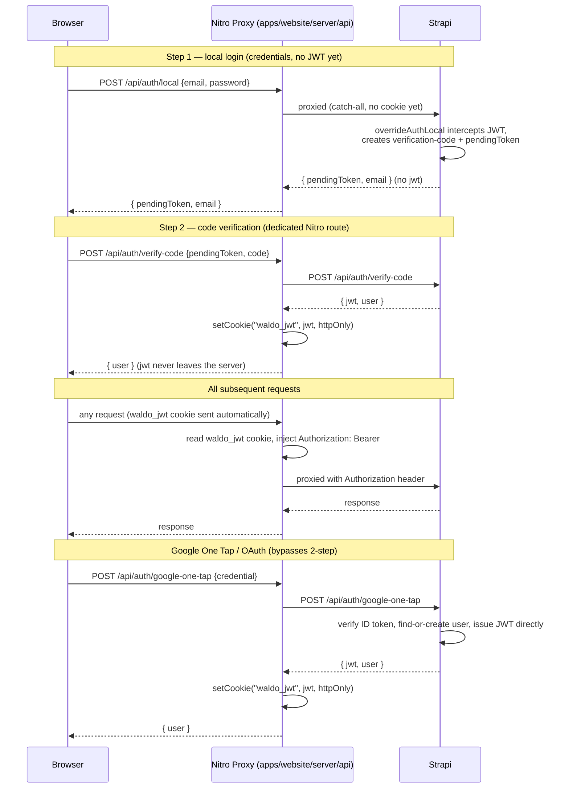
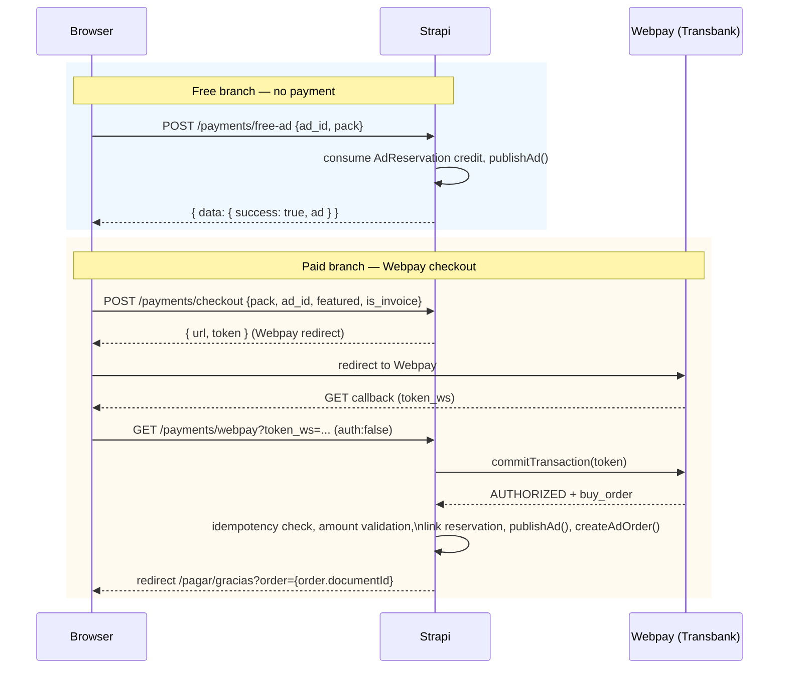
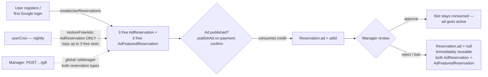
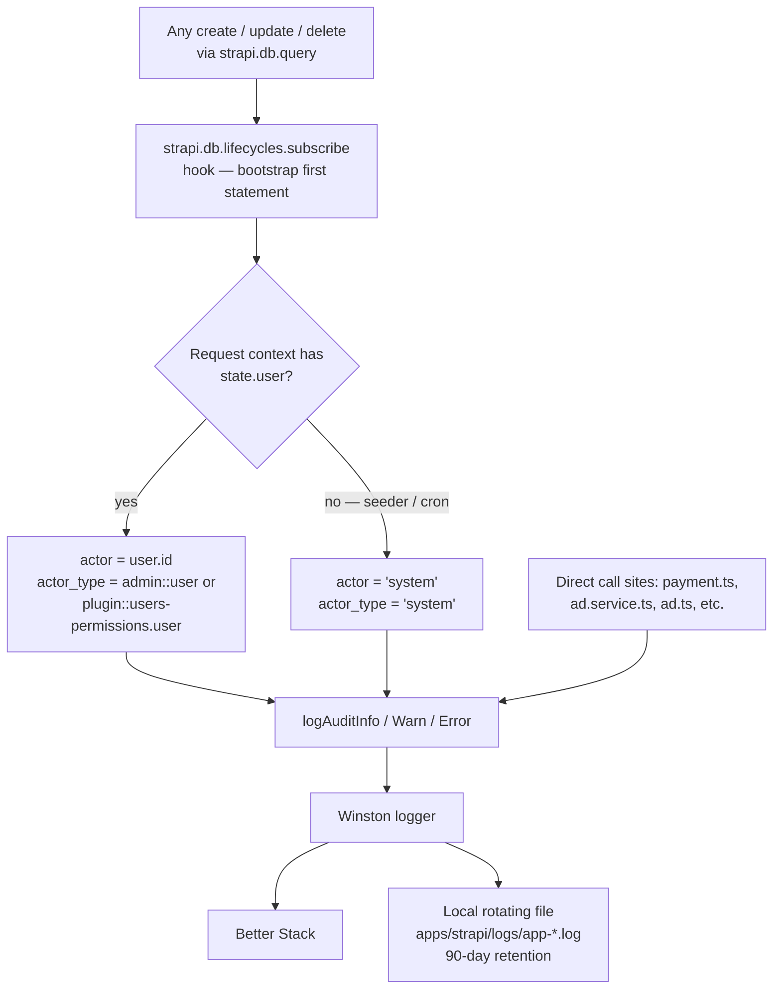
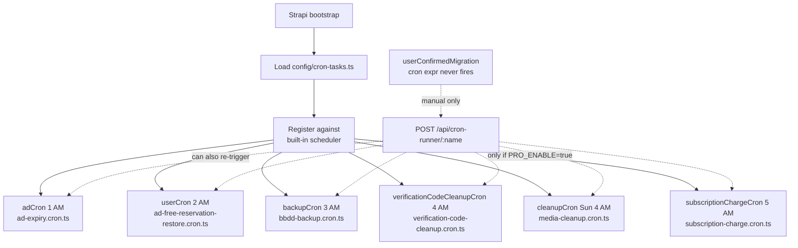

# Application Flows (FLOWS)

This document describes the Waldo Project's core application flows **as they exist in the current codebase** (as-built), not as originally speculated or as described in any prior documentation. Each flow below was re-derived directly from live source files — controllers, services, routes, middleware, and cron configuration — not paraphrased from `.planning/codebase/*`, `.planning/milestones/*`, or the pre-existing `docs/*.md` set. Where those existing documents were used as a starting lead, their content was cross-checked against the current code and corrected inline where stale (see each flow's "Correction" notes).

The platform is two packages, not three: `apps/strapi` (backend/business logic) and `apps/website` (public site + `/dashboard/**` admin routes, gated by `dashboard-guard.global.ts`). There is no separate `apps/dashboard` package — this is documented in full in `docs/TRD.md`'s "Inconsistencias detectadas" note; it is referenced here only where it affects a flow's frontend routing.

## Table of Contents

- [Flow 1: Authentication](#flow-1-authentication)
- [Flow 2: Ad Creation → Moderation → Publish](#flow-2-ad-creation--moderation--publish)
- [Flow 3: Payment / Checkout](#flow-3-payment--checkout)
- [Flow 4: Reservation System](#flow-4-reservation-system)
- [Flow 5: CRUD + Audit Log](#flow-5-crud--audit-log)
- [Flow 6: Cron Jobs](#flow-6-cron-jobs)
- [Preguntas abiertas](#preguntas-abiertas)

---

## Flow 1: Authentication

**Source files:** `apps/strapi/src/extensions/users-permissions/controllers/authController.ts`, `apps/strapi/src/api/auth-verify/controllers/auth-verify.ts`, `apps/strapi/src/api/auth-google/controllers/auth-google.ts`, `apps/strapi/src/api/auth-one-tap/controllers/auth-one-tap.ts`, `apps/website/server/api/auth/verify-code.post.ts`, `apps/website/server/api/auth/google-one-tap.post.ts`, `apps/website/server/api/auth/logout.post.ts`, `apps/website/server/api/[...].ts`, `apps/website/app/middleware/auth.ts`, `apps/website/app/middleware/dashboard-guard.global.ts`.

Waldo supports four entry paths into an authenticated session — local email/password with mandatory two-step verification, Google OAuth (popup redirect), Google One Tap, and (registration-only) the same local flow gated by AI free-text validation. All four terminate in the same place: a Strapi-issued JWT that a Nitro server route converts into an **httpOnly cookie** (`waldo_jwt`) — the JWT itself is never exposed to client-side JavaScript.

### Happy path — local email/password (two-step)

1. Client `POST`s credentials to `/api/auth/local` (proxied through Nitro's catch-all `[...].ts`, which injects `Authorization` from the cookie on other calls but not here — no cookie exists yet).
2. `overrideAuthLocal` (wrapping Strapi's built-in `auth.local` controller) calls the original controller first. If credentials are valid, the original response would normally contain a JWT — `overrideAuthLocal` intercepts it: it never lets the JWT reach the response body.
3. Instead, it generates a 6-digit numeric code (`crypto.randomInt`), a `pendingToken` (`crypto.randomUUID()`), persists both plus a 15-minute expiry on the `verification-code` content-type (deleting any prior pending record for that user), sends the code via the `verification-code` MJML template (non-fatal — failure does not abort the response), and replies with `{ pendingToken, email }` — no JWT.
4. Client `POST`s `{ pendingToken, code }` to `/api/auth/verify-code`. This is proxied via a **dedicated Nitro route** (`apps/website/server/api/auth/verify-code.post.ts`), not the generic catch-all — this route calls Strapi's `POST /api/auth/verify-code` (handled by `verifyCode` in `authController.ts`, exposed through `auth-verify.ts` because plugin-extension routes cannot be pushed in Strapi v5), receives `{ jwt, user }`, and sets `waldo_jwt` as an **httpOnly, `sameSite: lax`, 7-day cookie** — the JWT is discarded from the Nitro layer's own response; the browser only ever receives `{ user }`.
5. From then on, every other request goes through the catch-all proxy (`apps/website/server/api/[...].ts`), which reads `waldo_jwt` from the incoming request's cookie jar and injects it as `Authorization: Bearer <jwt>` before forwarding to Strapi. The client's own JavaScript never holds the token.

### Happy path — Google OAuth and Google One Tap (2-step bypassed)

Both Google-authenticated paths issue a Strapi JWT directly, with no verification-code step — Google has already asserted the user's identity via a signed ID token.

- **Google One Tap:** Client posts the Google Identity Services `credential` to `apps/website/server/api/auth/google-one-tap.post.ts`, which forwards it to Strapi's `POST /api/auth/google-one-tap` (`auth-one-tap.ts`). The controller verifies the credential via `googleOneTapService.verifyCredential` (RS256/JWKS), finds-or-creates the user (throwing — treated as 401 — if `email_verified` is false), grants 3 free ad + 3 free featured reservations on first creation (fire-and-forget `createUserReservations`), issues the JWT via the same `strapi.plugins["users-permissions"].services.jwt.issue()` call used everywhere else, and returns `{ jwt, user }`. The Nitro route sets the same httpOnly `waldo_jwt` cookie and returns only `{ user }` to the browser.
- **Google OAuth (popup):** `auth-google.ts`'s `initiate`/`callback` pair drives a full OAuth code exchange (`google-auth-library`), then verifies the resulting ID token through the same `googleOneTapService`, finds-or-creates the user, issues the JWT, and either returns `{ jwt }` (JSON mode, `?json`, used by the popup-callback Nitro route which sets the cookie) or renders an HTML page that posts a message back to the opening window via `BroadcastChannel`/`window.opener` and closes itself.

### Error states

- **Invalid credentials (step 1):** `overrideAuthLocal` short-circuits — if the wrapped controller's response has no `jwt`, the original (unmodified) error response passes straight through.
- **Invalid/expired verification code:** `verifyCode` returns 401 for an expired code (deleting the record) or a wrong code (incrementing `attempts`); at 3 failed attempts the record is deleted and the client must log in again.
- **Resend rate limit:** `/api/auth/resend-code` enforces a 60-second cooldown (`RESEND_COOLDOWN_MS`), returning HTTP 429 if called sooner.
- **Anonymous (401) requests:** `auth.ts` and `dashboard-guard.global.ts` both treat a missing/expired session as "anonymous" rather than a hard error — `fetchUser()` failures are swallowed (`catch { /* anonymous */ }`).
- **SSR fail-open:** On the server render pass, if no user state is present yet, both guards `return` (skip enforcement) rather than redirect — the client-side hydration re-run of the same middleware performs the real check once `fetchUser()` has populated session state. This is an intentional trade-off (documented inline in both files), not a bug.
- **Google `email_verified === false`:** `googleOneTapService.findOrCreateUser` throws; both the One Tap and OAuth callback controllers convert this into `ctx.unauthorized(...)` / an error popup response rather than silently creating an account.

### Role-gated branch

`dashboard-guard.global.ts` runs globally on every route change and only engages for paths starting with `/dashboard`. It requires a resolved session user with `role.name.toLowerCase() === "manager"` — any other authenticated role (or anonymous) is redirected to `/` (or `/login` if no session at all). This is the sole role gate for the dashboard's route tree; individual dashboard pages do not re-check the role.



---

## Flow 2: Ad Creation → Moderation → Publish

**Source files:** `apps/strapi/src/api/ad/controllers/ad.ts`, `apps/strapi/src/api/ad/services/ad.ts`, `apps/strapi/src/api/ad/routes/00-ad-custom.ts`, `apps/strapi/src/api/ad/content-types/ad/schema.json`.

An ad's lifecycle is governed entirely by four boolean/numeric fields on the `Ad` content-type — `draft`, `active`, `rejected`, `banned`, and `remaining_days` — evaluated by a single pure function, `computeAdStatus()` in `ad.ts` (service), which is the **sole source of truth** for an ad's displayed status. There is no separate `status` column; it is always derived.

`computeAdStatus()` checks, in order: `draft === true` → `"draft"`; `rejected` → `"rejected"`; `banned` → `"banned"`; `active && !banned && !rejected && remaining_days > 0` → `"active"`; `!active && !banned && !rejected && remaining_days === 0` → `"archived"`; `!active && !banned && !rejected && remaining_days > 0 && (no ad_reservation key or reservation present)` → `"pending"`; anything else → `"unknown"`.

### Happy path

1. **Draft:** `POST /ads/save-draft` (`ad.saveDraft` → `saveDraft()` service method) creates or updates an `Ad` row with `draft: true`. New drafts get `duration_days: 15`, `remaining_days: 15`, and an auto-generated slug (`name-timestamp`, accent-stripped, kebab-cased). Updates are ownership-checked (`existingAd.user.id === userId`); a non-owner update attempt returns a 200 with `{ success: false }` (not an HTTP error). Both create and update paths write a `logAuditInfo` entry ("Borrador de anuncio creado/actualizado").
2. **Payment confirmation flips `draft: false`** — this happens inside `publishAd()` (payment domain, `apps/strapi/src/api/payment/utils/ad.utils.ts`), called from both the free (`free-ad.service.ts`) and paid (`checkout.service.ts`, `ad.service.ts`) payment paths. See Flow 3 for the payment step itself; from this flow's perspective, the ad transitions from `draft` to `pending` (awaiting manager approval) the moment `publishAd()` runs.
3. **Manager moderation** — a manager (role gate: `global::isManager` policy) reviews pending ads in `apps/website/app/pages/dashboard/ads/**` and calls one of:
   - `PUT /ads/:id/approve` → `approveAd()`: sets `active: true`, `actived_at`, `actived_by`; sends the `ad-approved` MJML email; on first publish only (`isFirstPublish` guard, always true here since `isPending` already required `active === false`), fires a non-blocking Zoho CRM contact-stats sync (`Ads_Published__c`, `Last_Ad_Posted_At__c`) — failures are caught and logged via `logAuditError`, never surfaced to the caller.
   - `PUT /ads/:id/reject` → `rejectAd()`: sets `rejected: true`, `reason_for_rejection` (default Spanish message if none supplied), `rejected_at`, `rejected_by`; **releases both the `ad_reservation` and `ad_featured_reservation`** associated with the ad (sets their `ad` FK back to `null`, making the credit reusable — see Flow 4); sends the `ad-rejected` email, which conditionally mentions credit restitution.
   - `PUT /ads/:id/banned` → `bannedAd()`: same reservation-release + email pattern as reject, but sets `banned: true`, `banned_at`, `reason_for_ban`, `banned_by`. The service also has an in-code owner-or-admin check, but since the route itself is gated by `global::isManager`, the route-level policy is the real enforcement boundary in practice.
4. **Active → expired:** the daily `adCron` (see Flow 6) decrements `remaining_days`; when it reaches 0 the ad is deactivated, transitioning `computeAdStatus()`'s result from `"active"` to `"archived"`.

### Error states

- `approveAd`/`rejectAd` both throw `"Advertisement is not pending approval"` if the ad's current state doesn't match the pending predicate (`active === false && banned === false && rejected === false && remaining_days > 0`) — this blocks double-approval and approving an already-rejected/banned ad.
- `bannedAd` throws `"Advertisement is already banned"` on a repeat call, and `"You don't have permission..."` if the caller is neither the owner nor an admin/manager role (defense-in-depth behind the route's own `global::isManager` gate).
- Email failures (approval/rejection/ban notifications) are caught and logged (`console.error`), never propagated — the state transition itself always succeeds independent of email delivery.
- `saveDraft` update on a non-existent or non-owned ad returns `{ success: false, message: ... }` rather than throwing, so the frontend can display an inline error without a hard navigation failure.

### Role-gated branch

`/ads/:id/approve`, `/ads/:id/reject`, and `/ads/:id/banned` all carry `config: { policies: ["global::isManager"] }` — only users with the `Manager` role can call them. `/ads/:id/deactivate` (owner self-service "end my ad early") carries **no** route policy; `deactivateAd()` enforces `isOwner || isManager` in-service instead.

```mermaid
stateDiagram-v2
    [*] --> draft: POST /ads/save-draft
    draft --> pending: publishAd() on payment confirmation (Flow 3)
    pending --> active: PUT /ads/:id/approve (global::isManager)
    pending --> rejected: PUT /ads/:id/reject (global::isManager)\nreleases ad_reservation + ad_featured_reservation
    active --> banned: PUT /ads/:id/banned (global::isManager)\nreleases ad_reservation + ad_featured_reservation
    active --> archived: adCron decrements remaining_days to 0
    active --> archived: PUT /ads/:id/deactivate (owner or manager)
    rejected --> [*]
    banned --> [*]
    archived --> [*]
```

---

## Flow 3: Payment / Checkout

**Source files:** `apps/strapi/src/api/payment/controllers/payment.ts`, `apps/strapi/src/api/payment/routes/payment.ts`, `apps/strapi/src/api/payment/services/checkout.service.ts`, `free-ad.service.ts`, `ad.service.ts`, `pack.service.ts`.

**Order identity is always `order.documentId`.** Payment-gateway references (Webpay `buy_order`, `token_ws`, `authorization_code`) are stored inside the order record for audit purposes only and are never used as a redirect parameter, primary key, or lookup value. `apps/website/app/pages/pagar/gracias.vue` receives `?order={documentId}` and calls `useOrderById(documentId)` — passing anything else 500s the page. This rule is enforced consistently across every payment code path traced below.

The live payment routes (`apps/strapi/src/api/payment/routes/payment.ts`) are: `POST /payments/free-ad`, `POST /payments/checkout`, `GET /payments/webpay`, `GET /payments/thankyou/:documentId`, `POST /payments/pro`, `GET /payments/pro-response`, `POST /payments/pro-cancel`. **`POST /payments/ad` (the older `adCreate`/`adResponse` controller pair) is commented out in the route file and marked `DEPRECATED` in-code — it has been replaced by the unified checkout flow (`checkoutCreate`/`webpayResponse`) described below.** `adCreate`/`adResponse` remain in `payment.ts` as dead code at the time of this writing; they are not wired to any route and do not run.

### Happy path — free ad (no payment)

1. Client calls `POST /ads/save-draft` (Flow 2) to get an `ad_id`.
2. Client `POST`s `{ ad_id, pack }` to `/api/payments/free-ad` → `freeAdCreate` → `FreeAdService.processFreeAd()`.
3. The service validates ownership (`ad.user.id === userId`), resolves a credit — `pack === "free"` consumes a `price: "0"` `AdReservation`, `pack === "paid"` consumes a previously purchased one (`price != "0"`) — links the reservation to the ad, updates ad duration from the reservation's `total_days` (paid path only), and calls `publishAd(adId)` (sets `draft: false`, transitioning the ad to `pending`).
4. Confirmation emails (`ad-creation-user`, `ad-creation-admin`) are sent inside a try/catch — failures are logged via `logAuditError` and never fail the request.

### Happy path — paid checkout (Webpay)

1. Client `POST`s `{ pack, ad_id?, featured?, is_invoice? }` to `/api/payments/checkout` → `checkoutCreate` → `CheckoutService.initiateCheckout()`, which returns a Webpay redirect `{ url, token }`.
2. Browser is redirected to Webpay; user completes (or cancels) the payment.
3. Webpay redirects the browser back via **GET** `/api/payments/webpay` (`webpayResponse`). This route is explicitly `config: { auth: false }` — Transbank's GET redirect carries no `Authorization` header, but the httpOnly-cookie proxy would otherwise inject the authenticated user's `waldo_jwt` as `Authorization` on *any* top-level GET (since `sameSite: lax` cookies are sent on top-level navigation), which would make Strapi apply the authenticated role (lacking payment-callback permissions) and 403 the callback. Marking the route `auth: false` makes the Webpay token — not `ctx.state.user` — the only identity that matters here.
4. `checkoutService.processWebpayReturn(token)`: commits the Webpay transaction, validates `status === "AUTHORIZED"`, parses the identity payload out of `buy_order` (format `order-{userId}-{packId}-{adId}-{featured}-{isInvoice}` — the gateway field carries context, never identity for redirect purposes), checks for an existing order with the same `buy_order` (idempotent replay guard — a retried callback returns the already-created `order.documentId` rather than double-processing), validates the charged amount against a fail-closed `AD_FEATURED_PRICE` env var, links/creates the appropriate reservation, calls `publishAd()`, creates the `Order` record via `OrderUtils.createAdOrder()`, and returns `{ success: true, orderDocumentId }`.
5. `webpayResponse` redirects the browser to `${FRONTEND_URL}/pagar/gracias?order=${result.orderDocumentId}` — **never** `buyOrder` or any gateway token.

### Error states

- **Payment not authorized:** `processWebpayReturn` returns `{ success: false }` if Webpay's commit response isn't `AUTHORIZED` → `webpayResponse` redirects to `/pagar/error?reason=rejected`.
- **User cancellation:** Webpay omits `token_ws` and instead sends `TBK_TOKEN` on cancellation — `webpayResponse` detects the missing `token_ws`, logs a `logAuditWarn`, and redirects to `/pagar/error?reason=cancelled` without calling the gateway at all.
- **Order record creation fails after a successful charge:** if `OrderUtils.createAdOrder()` throws inside `processWebpayReturn`'s paid-pack branch, the error is caught and logged (`logAuditError`), but `orderDocumentId` stays `undefined` — `webpayResponse` then redirects to `/pagar/gracias?error=no-receipt` rather than the error page, because the bank charge is real and the ad may already be published; the user simply doesn't get a documentId-backed receipt.
- **Missing `AD_FEATURED_PRICE`:** the amount-validation step throws rather than silently trusting the gateway's charged amount — a fail-closed guard against a misconfigured environment ever processing a payment with no price floor.
- **Idempotent replay:** a duplicate Webpay callback for the same `buy_order` short-circuits to the existing order's `documentId` instead of creating a second order or double-publishing the ad.

### Free vs. paid branch

The two payment paths are structurally separate controllers/services (`freeAdCreate`/`FreeAdService` vs. `checkoutCreate`+`webpayResponse`/`CheckoutService`) rather than a single branching endpoint, but converge on the same `publishAd()` call and the same audit-log envelope (see Flow 5) for their logging.

**Out of scope for this diagram:** the PRO subscription payment flow (`POST /payments/pro`, `GET /payments/pro-response`, `POST /payments/pro-cancel` — Webpay Oneclick Mall inscription + recurring billing) exists in the same controller and follows the same `documentId`-identity and `auth:false`-callback patterns, but is a separate recurring-billing flow, not part of the six mandated core flows for this document.



---

## Flow 4: Reservation System

**Source files:** `apps/strapi/src/api/ad-reservation/`, `apps/strapi/src/api/ad-featured-reservation/`, `apps/strapi/src/cron/ad-free-reservation-restore.cron.ts`, `apps/strapi/src/api/ad/services/ad.ts` (`publishAd()` slot consumption via `apps/strapi/src/api/payment/utils/ad.utils.ts`).

**Correction (per D-10 — current code wins):** `docs/reservation-system.md` cites the restore-cron's source path as `apps/strapi/src/crons/user-*.cron.ts` (plural `crons/`, `user-*` glob). The actual file is `apps/strapi/src/cron/ad-free-reservation-restore.cron.ts` (singular `cron/` directory, default-exported class `UserCronService`). Its `restoreFreeAds()` method restores **`AdReservation` (free ad-listing) slots only** — it does not touch `AdFeaturedReservation` records; there is no separate scheduled featured-reservation restore job (an earlier `featuredCron` was implemented and then reverted, per `.planning/STATE.md`'s decision log — the free-slot guarantee for featured reservations is not currently cron-enforced).

Every user gets 3 free `AdReservation` records (`price: 0`, `total_days: 15`) and 3 free `AdFeaturedReservation` records (`price: 0`) automatically on registration or first Google login (`createUserReservations()` in `authController.ts`, called from local registration, Google OAuth, and Google One Tap — see Flow 1). These are the "3 free ad slots" a user can spend on new ad listings and featured placement without paying.

### Happy path

1. **Reserve/consume:** when an ad is published (via `publishAd()`, either free or paid path — see Flows 2 and 3), the service links an available `AdReservation` (and, if featured, an `AdFeaturedReservation`) to the ad by setting the reservation's `ad` foreign key. A reservation with `price: "0"` is a free-tier slot; anything else is a purchased one.
2. **Restore on reject/ban:** `rejectAd()` and `bannedAd()` in `ad.ts` both explicitly free the `ad_reservation` and `ad_featured_reservation` FKs back to `null` (`{ data: { ad: null } }`) at the moment of rejection/ban — this is synchronous, in the same request, not deferred to a cron. The associated credit becomes immediately reusable for a new ad.
3. **Nightly safety-net restore (`AdReservation` only):** `ad-free-reservation-restore.cron.ts` (`userCron`, see Flow 6) runs daily, per user, to guarantee 3 free (`price: "0"`) `AdReservation` slots are always either available (`ad = null`) or in genuine use (linked to an ad with `remaining_days > 0` and not `banned`/`rejected`). A reservation linked to an ad that has run out of `remaining_days`, been banned, or been rejected no longer counts toward the 3 — it is treated as spent history, and a fresh free reservation is created to top the user back up. This is a backstop independent of the explicit reject/ban restoration in step 2, batched in groups of 50 users with `Promise.all` per batch to avoid DB connection-pool exhaustion. **`AdFeaturedReservation` slots have no equivalent scheduled restore** (see Correction above) — their only restore path is the synchronous reject/ban release in step 2.
4. **Gifting:** `POST /api/ad-reservations/gift` and `POST /api/ad-featured-reservations/gift` (both gated `global::isManager`) let a manager create N reservation records directly assigned to a selected Authenticated user, notifying them via the `gift-reservation` MJML template (non-fatal on email failure).

### Error states

- No reservation available at checkout/free-ad time → the payment flow (Flow 3) returns `{ success: false, message: "No free reservation available" }` / `"No paid reservation available"` — the ad is never published without a linked credit.
- No `try/catch` wraps the reservation-freeing calls inside `rejectAd`/`bannedAd` — an intentional design choice: if freeing a reservation fails, the whole reject/ban operation should fail loudly rather than silently orphan the credit.

### Role-gated branch

Both gift endpoints require `global::isManager`. Standard reserve/consume/restore operations require no special role — they operate on the requesting user's own reservation pool (or, for the nightly cron, run with system-level access across all users).



---

## Flow 5: CRUD + Audit Log

**Source files:** `apps/strapi/src/subscribers/audit-log.subscriber.ts`, `apps/strapi/src/utils/audit-log/index.ts`, `apps/strapi/src/index.ts`.

Every content mutation in Strapi is captured by a single global lifecycle hook, `registerAuditLogSubscriber(strapi)`, registered as the **first statement** inside `bootstrap()` in `apps/strapi/src/index.ts` — this ordering ensures even seeder/backfill writes that run later in bootstrap are captured and correctly attributed. The hook wraps `strapi.db.lifecycles.subscribe()` and fires on `create`/`update`/`delete` across all content-types.

Rather than writing to a database table, every audit event is written through the shared `logAudit*` helper (`apps/strapi/src/utils/audit-log/index.ts`) into the project's existing Winston logger (Better Stack + 90-day local file rotation) — **this is a deliberate architectural pivot**, not the original design: an earlier iteration stored audit entries in a dedicated `audit-log` content-type, which was deleted entirely in favor of the logger-based approach.

The canonical envelope, enforced by `logAuditInfo` / `logAuditWarn` / `logAuditError`:

```typescript
export interface AuditMeta {
  actor: number | "system";
  actor_type: "admin::user" | "plugin::users-permissions.user" | "system";
  data?: Record<string, unknown>;
}
```

`actor` is the numeric user id when the action was performed by an authenticated request-context user, or the literal string `"system"` when no request context exists (seeders, cron jobs, or code paths that lexically precede a userId resolution). `actor_type` mirrors this: `admin::user` for Strapi admin-panel actors, `plugin::users-permissions.user` for regular API users, `system` for unattributed system actions. `data` carries a free-form payload relevant to the event (ids, error messages, etc.).

**This envelope is the canonical reference for the entire codebase.** Flows 2 (ad moderation) and 3 (payment) both write through the same `logAuditInfo`/`logAuditWarn`/`logAuditError` calls documented here rather than re-describing the envelope in each flow.

### Happy path

1. Any `strapi.db.query(...).create/update/delete(...)` call (or an entityService/content-API mutation that routes through the same query engine) fires the corresponding lifecycle event.
2. `audit-log.subscriber.ts`'s `recordAuditEntry()` handler reads `strapi.requestContext.get()` and inspects `reqCtx.state.auth.strategy.name` to determine `actor_type`: `"admin"` strategy → `admin::user`, `"users-permissions"` strategy → `plugin::users-permissions.user`, no request context at all (or an unrecognized strategy) → `"system"`. `actor` is `reqCtx.state.user?.id` when `actor_type` resolved to a user type, and the literal string `"system"` otherwise — so `actor` is a number if and only if `actor_type` is a real user type, never a mismatched pair. It then calls `logAuditInfo` with the envelope above.
3. Winston writes the structured log line to Better Stack (if configured) and to a local rotating file (`apps/strapi/logs/app-*.log`, 90-day retention) — there is no database table to query; the read path is `tail -f apps/strapi/logs/app-*.log` or the Better Stack dashboard.
4. Direct call sites across the payment and ad domains (`payment.ts`, `ad.service.ts`, `pack.service.ts`, `checkout.service.ts`, `free-ad.service.ts`, `ad.ts` controller) were homologated to call `logAuditInfo`/`logAuditWarn`/`logAuditError` directly at meaningful business events (not just relying on the generic lifecycle hook), so that log messages carry human-readable context (e.g. "Orden creada exitosamente") rather than generic CRUD noise.

### Error states

- Because the handler is synchronous and logger calls fire no further lifecycle events, there is **no recursion risk** — an earlier design needed an explicit recursion guard (skipping the `audit-log` content-type's own writes); that guard was removed entirely once the storage mechanism moved off a Strapi content-type.
- Winston transport failures are caught in a `try/catch` inside `recordAuditEntry` (synchronous, but transports can still throw) — a logging failure never blocks the underlying business operation that triggered it.
- Bulk `*Many` operations (`updateMany`, `deleteMany`) are intentionally out of scope for the lifecycle hook — documented as a known gap, not an oversight.

### Role-gated branch

Not applicable — the subscriber fires for every mutation regardless of the caller's role; role/permission enforcement happens upstream at the route/policy layer (e.g. `global::isManager` on ad moderation routes), and the audit log simply records whoever the resolved actor was.



---

## Flow 6: Cron Jobs

**Source files:** `apps/strapi/config/cron-tasks.ts` (source of truth), `apps/strapi/config/server.ts`, `apps/strapi/src/cron/*.cron.ts` (6 files), `apps/strapi/src/api/cron-runner/controllers/cron-runner.ts`.

**Correction (per D-10 — current code wins):** Both this repository's own `CLAUDE.md` ("Four active cron jobs: `adCron`, `userCron`, `backupCron`, `cleanupCron`") and this phase's own initial context brief undercounted the active cron jobs. `apps/strapi/config/cron-tasks.ts`, registered via `apps/strapi/config/server.ts`'s `cron: { enabled: true, tasks: cronTasks }`, currently registers **6 active scheduled jobs plus 1 manual-trigger-only task** — not 4.

| Key | Schedule | Source file | Purpose |
|---|---|---|---|
| `adCron` | `0 1 * * *` (1 AM) | `src/cron/ad-expiry.cron.ts` | Decrements `remaining_days`, deactivates expired ads |
| `userCron` | `0 2 * * *` (2 AM) | `src/cron/ad-free-reservation-restore.cron.ts` | Restores free ad + featured reservation slots (Flow 4) |
| `backupCron` | `0 3 * * *` (3 AM) | `src/cron/bbdd-backup.cron.ts` | `pg_dump` database backup, 7-file rotation |
| `verificationCodeCleanupCron` | `0 4 * * *` (4 AM) | `src/cron/verification-code-cleanup.cron.ts` | Bulk-deletes expired `verification-code` records (Flow 1) |
| `cleanupCron` | `0 4 * * 0` (Sunday 4 AM) | `src/cron/media-cleanup.cron.ts` | Orphan media audit (Cloudinary) — audit-only, never auto-deletes |
| `subscriptionChargeCron` | `0 5 * * *` (5 AM), **only registered when `PRO_ENABLE=true`** | `src/cron/subscription-charge.cron.ts` | Monthly PRO subscription billing via Webpay Oneclick |
| `userConfirmedMigration` | `0 0 1 1 *` (far-future placeholder — never auto-fires) | inline, calls `../seeders/user-confirmed-migration` | **Manual-trigger-only** — a one-time data migration, not a recurring job |

### Happy path

1. Strapi loads `cron-tasks.ts` at startup; each entry with a real cron expression is registered against Strapi's built-in scheduler (`config/server.ts`'s `cron.tasks` block).
2. Each job runs unattended on its schedule, performing its specific maintenance task (ad expiry, reservation restoration, DB backup, cleanup, billing).
3. **Manual execution:** any registered task — including the manual-only `userConfirmedMigration` — can also be triggered on demand via `POST /api/cron-runner/:name`, handled by `cron-runner.ts`. This is the only way `userConfirmedMigration` ever runs, since its cron expression (`0 0 1 1 *`, "once at midnight on Jan 1") is deliberately set far enough out that it functions as a no-op schedule.

### Error states

- `subscriptionChargeCron` is conditionally registered — if `PRO_ENABLE` is not `"true"`, the job simply doesn't exist in the scheduler; there is no error, just absence. Any code path assuming exactly 6 unconditional jobs would be wrong in an environment with PRO disabled (5 unconditional + 1 manual-only in that case).
- `media-cleanup.cron.ts` is explicitly audit-only — it logs orphaned media candidates but never deletes them automatically, avoiding accidental data loss from a false-positive orphan detection.
- Manual trigger via `cron-runner.ts` surfaces job failures directly in the HTTP response (synchronous execution), unlike the scheduled path where a failure is only visible in logs/audit entries (Flow 5).

### Role-gated branch

The `cron-runner` manual-trigger endpoint is intended for operational/admin use; production access control for it is out of scope for this flow trace and not independently re-verified here (see Preguntas abiertas).



---

## Preguntas abiertas

1. **`docs/analytics-events.md` staleness (dated 2026-03-14, oldest of the pre-existing `/docs/*.md` set):** not independently re-verified against the current GA4/GTM implementation in this pass. Analytics events are not one of the six mandated flows for this document, so this was deliberately deprioritized rather than blocking FLOWS.md — flagged here per D-09 rather than silently assumed accurate.
2. **`cron-runner` manual-trigger endpoint access control:** `POST /api/cron-runner/:name` (Flow 6) was traced to confirm it exists and can re-run any registered job, but its route-level policy/permission configuration was not re-verified in this pass — worth a follow-up check to confirm it is not publicly callable.
3. **PRO subscription payment flow (`/payments/pro`, `/payments/pro-response`, `/payments/pro-cancel`) full trace:** confirmed to exist and to follow the same `order.documentId`-identity and `auth:false`-callback patterns as the core checkout flow (Flow 3), but was not diagrammed in full per this document's six-flow mandate — a dedicated deep-dive would be needed if PRO billing specifics become load-bearing for future documentation.
